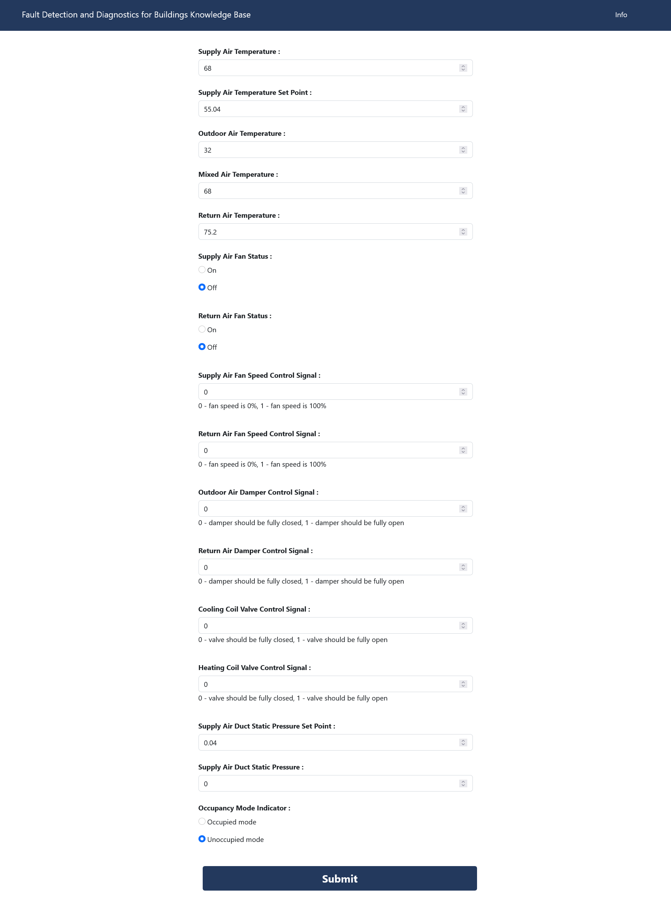
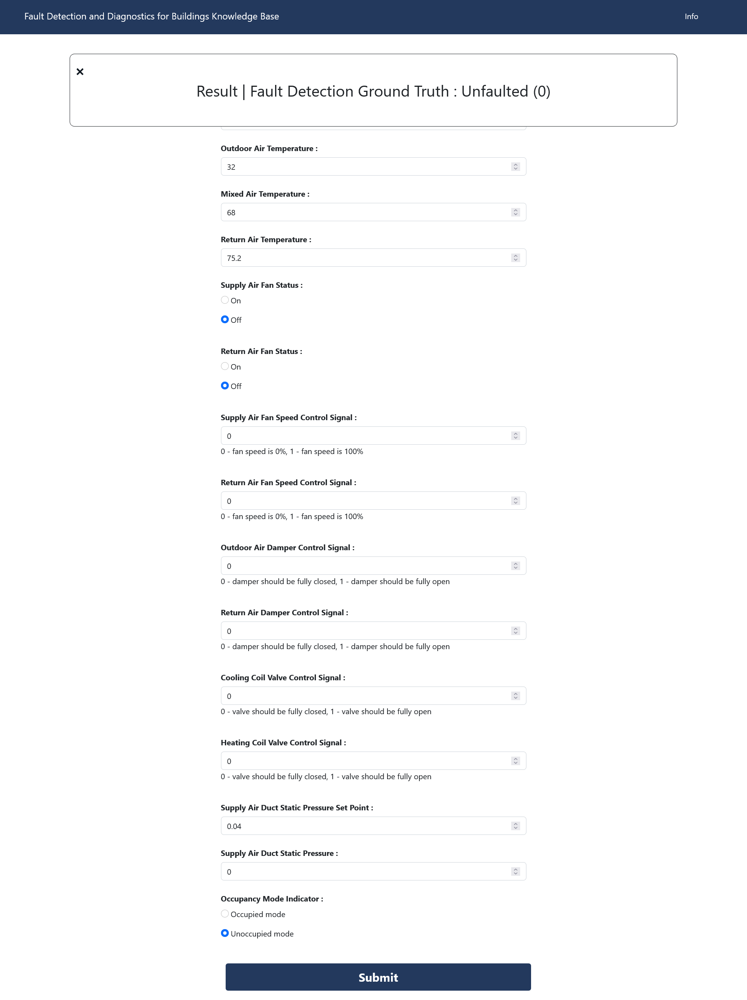

# Tugas IF4070 Representasi Pengetahuan dan Penalaran : Knowledge Based System
> Fault detection and diagnostics algorithms for buildings Knowledge Base
## How to run (locally):
1. Run [main.html](frontend/main.html) in the browser
2. Fill the fields
3. Click "Submit" at the bottom of the page
4. See result at the top of the page

## Deployment
[This Url](https://moshval.github.io/simple_kbs)

## Data Source
[Data Sets for Evaluation of Building Fault Detection and Diagnostics Algorithms](https://catalog.data.gov/dataset/data-sets-for-evaluation-of-building-fault-detection-and-diagnostics-algorithms-2de50)

## Documentation
[Documentation](docs/Laporan%20IF4070-13519018-13519069-13519091.pdf)

## Screenshots

## Contributors
- Mohammad Sheva Almeyda Sofjan (13519018)
- Muhammad Fikri N. (13519069)
